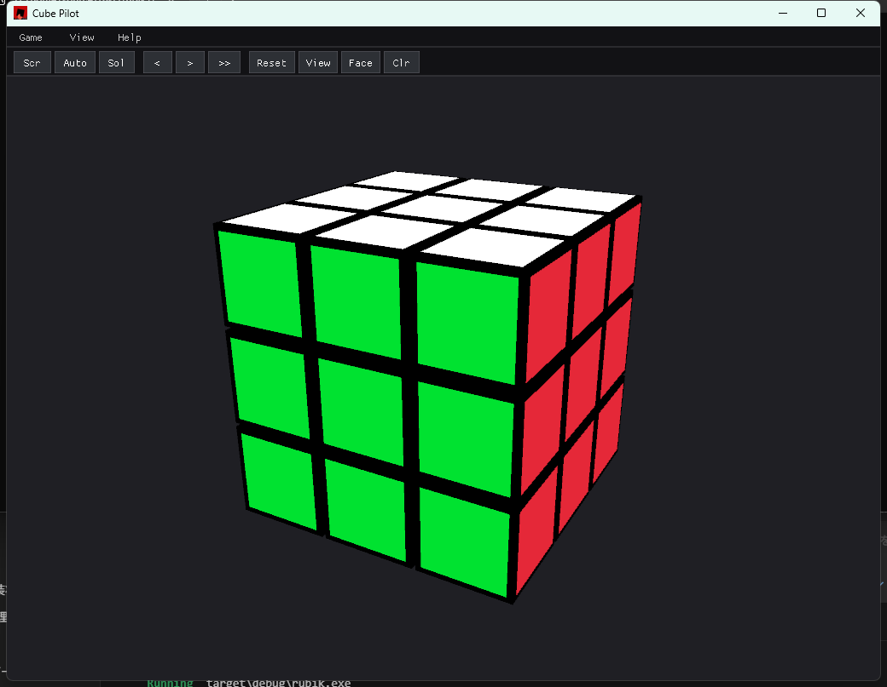

# Cube Pilot

Macroquad-based 3D cube viewer and controller.

[日本語版](README.ja.md)

Version: 0.6.0

## Screenshot



## Run

```powershell
cargo run
```

## Key Assignments

The app also has a compact menu bar and toolbar at the top of the window.
Toolbar buttons mirror the main actions: scramble/stop, auto shuffle, solve,
solution stepping, reset, reset view, front-face labels, and pin clearing.

### Menu, Toolbar, and Shortcuts

| Menu | Toolbar | Shortcut | Action |
| --- | --- | --- | --- |
| Game > Scramble / Stop | Scr | Space | Start a normal scramble when idle; stop the current animation or auto shuffle when running |
| Game > Auto Shuffle | Auto | Shift + A | Toggle slow auto shuffle; the toolbar button is highlighted while active |
| Game > Solve | Sol | S | Solve the current cube when idle |
| Help > Solution Prev | < | Left Arrow | Undo the previous solution step |
| Help > Solution Next | > | Right Arrow | Play the next solution step |
| Help > Solution Play | >> | Down Arrow | Play all remaining solution steps |
| Game > Reset | Reset | Shift + R | Reset the cube and clear queued animations |
| View > Reset View | View | Numpad 5 | Return the camera to the default view |
| View > Front Labels | Face | F | Blink the current front face and show its numpad labels |
| View > Clear Pins | Clr | - | Clear all pinned markers |
| Game > Quit | - | Esc | Quit the app |

### Cube Rotation

These moves are relative to the current view.
The front face can also be clicked like a numpad: click the 7/4/1 positions
for left row turns, click the 9/6/3 positions for right row turns, or hold
Shift and click the 1/2/3 or 7/8/9 positions for column turns.

| Key | Action |
| --- | --- |
| Numpad 7 | Rotate the top visible row left |
| Numpad 4 | Rotate the middle visible row left |
| Numpad 1 | Rotate the bottom visible row left |
| Numpad 9 | Rotate the top visible row right |
| Numpad 6 | Rotate the middle visible row right |
| Numpad 3 | Rotate the bottom visible row right |
| Shift + Numpad 1 | Rotate the left visible column forward |
| Shift + Numpad 2 | Rotate the middle visible column forward |
| Shift + Numpad 3 | Rotate the right visible column forward |
| Shift + Numpad 7 | Rotate the left visible column backward |
| Shift + Numpad 8 | Rotate the middle visible column backward |
| Shift + Numpad 9 | Rotate the right visible column backward |
| Left Click on front 7/4/1 position | Rotate that visible row left |
| Left Click on front 9/6/3 position | Rotate that visible row right |
| Shift + Left Click on front 1/2/3 position | Rotate that visible column forward |
| Shift + Left Click on front 7/8/9 position | Rotate that visible column backward |

### Shuffle and Solver

| Key | Action |
| --- | --- |
| Space | Start a normal scramble when idle; stop the current animation or auto shuffle when running |
| Shift + A | Toggle slow auto shuffle; it keeps adding slow scramble moves until stopped |
| S | Solve the current cube when idle |
| Right Arrow | Play the next solution step |
| Left Arrow | Undo the previous solution step |
| Down Arrow | Play all remaining solution steps |
| Shift + R | Reset the cube and clear queued animations |

### View and Display

| Key / Input | Action |
| --- | --- |
| Mouse drag | Orbit the camera |
| Ctrl + Numpad 7 or Ctrl + Numpad 4 | Yaw the camera left |
| Ctrl + Numpad 9 or Ctrl + Numpad 6 | Yaw the camera right |
| Ctrl + Numpad 8 | Pitch the camera up |
| Ctrl + Numpad 2 | Pitch the camera down |
| Ctrl + Left Click on front 7/4 position | Yaw the camera left |
| Ctrl + Left Click on front 9/6 position | Yaw the camera right |
| Ctrl + Left Click on front 8 position | Pitch the camera up |
| Ctrl + Left Click on front 2 position | Pitch the camera down |
| Numpad 5 | Reset the camera view |
| F | Blink the current front face and show its numpad labels |
| F + Left Click | Pin the clicked front-face sticker until cleared |
| Esc | Quit |
